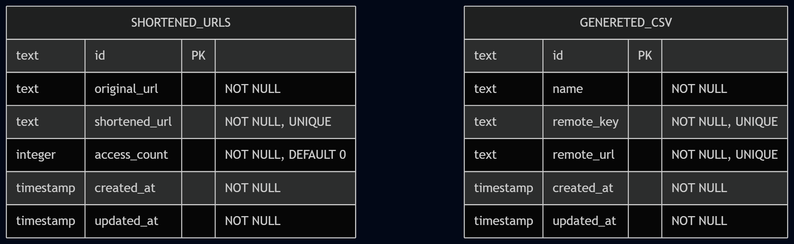

# Prova Prática

Este repositório contém a implementação da prova prática, dividida em duas aplicações:

* **server/** → Back-end
* **web/** → Front-end

## Requisitos

Antes de iniciar, certifique-se de possuir instalado:

* **Node.js:** `24.15.0`
* **pnpm**
* **Docker** e **Docker Compose** (para executar o banco de dados)

---

# Front-end (Vite + React + TypeScript)

A aplicação foi desenvolvida utilizando **Vite**, **React** e **TypeScript**.

## Instalação

Entre na pasta `web`:

```bash
cd web
```

Instale as dependências:

```bash
pnpm install
```

Execute o build da aplicação:

```bash
pnpm run build
```

Caso deseje executar em modo de desenvolvimento:

```bash
pnpm run dev
```

---

# Back-end

Entre na pasta `server`:

```bash
cd server
```

## Instalação

Instale as dependências:

```bash
pnpm install
```

## Banco de dados

Suba apenas o banco de dados:

```bash
docker compose up db
```

Execute as migrações:

```bash
pnpm run db:migrate
```

Visualize o banco de dados através do Drizzle Studio:

```bash
pnpm run db:studio
```

## Executando a aplicação

Inicie o servidor:

```bash
pnpm run dev
```

A documentação da API estará disponível em:

```
http://localhost:3333/docs
```

---

# Docker

Caso deseje executar toda a aplicação utilizando Docker (back-end + banco de dados), execute:

```bash
docker compose up
```

> **Observação:** Para desenvolvimento, recomenda-se utilizar:
>
> 1. `docker compose up db`
> 2. `pnpm run db:migrate`
> 3. `pnpm run dev`
>
> Dessa forma, apenas o banco de dados será executado via Docker, enquanto o back-end ficará em modo de desenvolvimento.

---

# Modelagem de Dados



